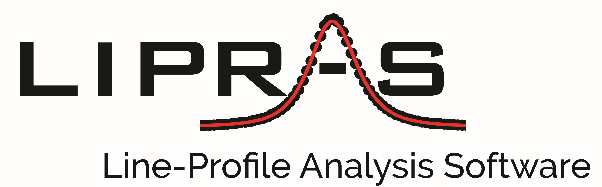

  

# 

## Authors
Giovanni Esteves, Klarissa Ramos, Chris M. Fancher, and Jacob L. Jones

Contact Info 
<b>Email:</b> lipras17@gmail.com 
<i> Please include "LIPRAS" in subject </i>

<b> History: </b>Jacob L. Jones created the original code in 2006–2007. Chris M. Fancher expanded it in 2014 and converted it into a MATLAB class. Giovanni Esteves then refined and extended it, and in 2016 Klarissa Ramos and Giovanni developed the GUI now known as LIPRAS. Today, LIPRAS is maintained by Giovanni and has been migrated to MATLAB App Designer.

## What is LIPRAS?

**LIPRAS** [*LEEP-ruhs*], short for **Line-Profile Analysis Software**, is a graphical user interface for least-squares fitting of Bragg peaks in powder diffraction data. For any region of the inputted data, user can choose which profile functions to apply to the fit, constrain profile functions, and view the resulting fit in terms of the profile functions chosen. A Bayesian inference analysis can be carried out on the resulting least-squares result to generate a full description of the errors for all profile parameters.

## Features in LIPRAS
<b> Why use LIPRAS?</b> You can use LIPRAS to visualize and analyze diffraction data.

<ul>
<li> Quickly extract relevant peak information about the <b>position, full width at half maximum (FWHM), and intensity</b> </li>
<li> Conduct Bayesian inference on least-squares results using a Markov Chain Monte Carlo algorithm</li>
<li> Customize the background fit by either treating it separately (Polynomial or Spline) or including it in the least-squares routine (Polynomial only)</li>
<li> Can analyzes files with a different number of data points and/or X-values, however, check fitting range before attempting </li>
<li> Fit up to <b>20 peaks</b> in the current profile region </li>
<li> Choose from 5 peak-shape functions: <b>Gaussian, Lorentzian, Pseudo-Voigt, and Pearson VII, and Asymmetric Pearson VII</b> </li>
<li> Peak-shape functions can be constrained in terms of intensity, peak position, FWHM, and mixing coefficient</li>
<li> Automatically calculate Cu-Kalpha2 peaks when working with laboratory X-ray data </li>
<li> Change any of the starting fit values and instantly view a sample plot of the fit, before conducting a fit</li>
<li> For multiple diffraction patterns, results from previous fit are subsequent starting parameters for next fit </li>
<li> Visualize results with a plot of the resulting peak fit and residual plot</li>
<li> Resulting coefficients values can be viewed with file number </li>
<li> Parameters files are written to recreate fits and detail what fit parameters and profile shape functions were used</li>
<li> Accepts the following <b>file types: .xy, .xye, .xls, .xlsx, .fxye, .xrdml, .chi, .csv (Windows Only)</b></li>
</ul>

## Changes from LIPRAS-Classic

<b> Background Point Selection </b>
* Click Select Points, then click on the plot to add points. Press Enter to finish, or Esc to cancel.

<b> Peak Point Selection </b>
* Click Select Peaks, then click peak locations until you reach the Number of Peaks. LIPRAS then plots the initial fit automatically.

## Installation
<b>MATLAB Users: Requires MATLAB 2024a or newer.</b>

<b>Curve Fitting Toolbox is recommended, </b> but not required. You can start using LIPRAS in MATLAB 2024a or newer after downloading it from File Exchange. Earlier MATLAB releases may also work, but could require minor tweaks to avoid errors. LIPRAS runs without the Curve Fitting Toolbox, but having it installed can improve fit speed and robustness in some cases.

**If you use LIPRAS for your research, please cite it (choose one):**

1. Giovanni Esteves, Klarissa Ramos, Chris M. Fancher, and Jacob L. Jones. LIPRAS: Line-Profile Analysis Software. (2017). DOI: 10.13140/RG.2.2.29970.25282/3
2. Giovanni Esteves, Klarissa Ramos, Chris M. Fancher, and Jacob L. Jones. LIPRAS: Line-Profile Analysis Software. (2017). https://github.com/SneakySnail/LIPRAS

## Acknowledgement
This website is based in part upon work supported by the National Science Foundation under Grant No. 1409399. Any opinions, findings and conclusions or recommendations expressed in this website are those of the author(s) and do not necessarily reflect the views of the National Science Foundation (NSF).

## License
LIPRAS BSD License,
Copyright (c) 2017, North Carolina State University
All rights reserved.
Redistribution and use in source and binary forms, with or without modification, are permitted provided
that the following conditions are met:

1. Redistributions of source code must retain the above copyright notice, this list of conditions and the
following disclaimer.
2. Redistributions in binary form must reproduce the above copyright notice, this list of conditions and
the following disclaimer in the documentation and/or other materials provided with the distribution.
3. The names North Carolina State University, NCSU and any tradename, personal name,
trademark, trade device, service mark, symbol, image, icon, or any abbreviation, contraction or
simulation thereof owned by North Carolina State University must not be used to endorse or promote
products derived from this software without prior written permission.
THIS SOFTWARE IS PROVIDED BY THE COPYRIGHT HOLDERS AND CONTRIBUTORS "AS IS" AND ANY
EXPRESS OR IMPLIED WARRANTIES, INCLUDING, BUT NOT LIMITED TO, THE IMPLIED WARRANTIES OF
MERCHANTABILITY AND FITNESS FOR A PARTICULAR PURPOSE ARE DISCLAIMED. IN NO EVENT SHALL
THE COPYRIGHT HOLDER OR CONTRIBUTORS BE LIABLE FOR ANY DIRECT, INDIRECT, INCIDENTAL,
SPECIAL, EXEMPLARY, OR CONSEQUENTIAL DAMAGES (INCLUDING, BUT NOT LIMITED TO,
PROCUREMENT OF SUBSTITUTE GOODS OR SERVICES; LOSS OF USE, DATA, OR PROFITS; OR BUSINESS
INTERRUPTION) HOWEVER CAUSED AND ON ANY THEORY OF LIABILITY, WHETHER IN CONTRACT, STRICT
LIABILITY, OR TORT (INCLUDING NEGLIGENCE OR OTHERWISE) ARISING IN ANY WAY OUT OF THE USE OF
THIS SOFTWARE, EVEN IF ADVISED OF THE POSSIBILITY OF SUCH DAMAGE.
